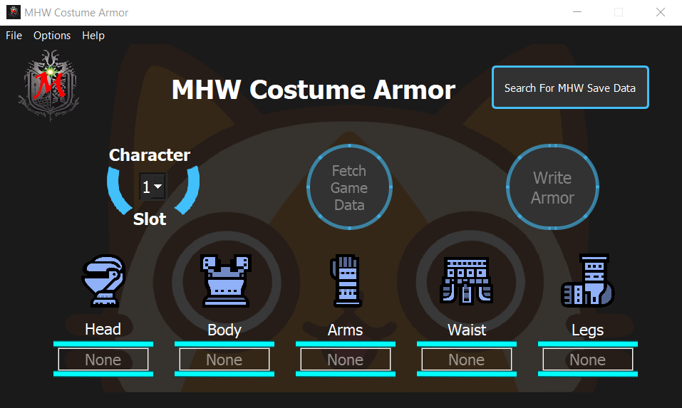
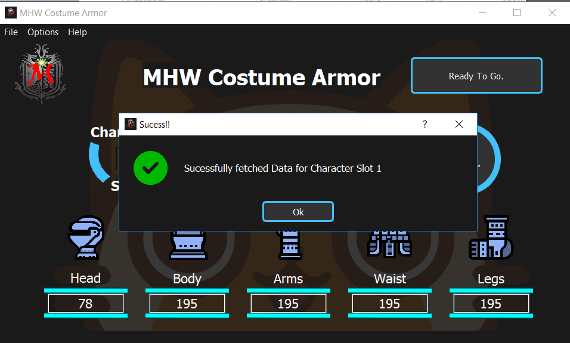

[](LICENCE)

# MHW Costume Armor

MHW Costume Armor is a Monster Hunter World MOD which includes graphic user interface to customize the layered armor equipped.

It is a C++ implementaion of the original [MHW Transmog](https://www.nexusmods.com/monsterhunterworld/mods/43) MOD based on a decompilation of it.

Update 22/12/2018 Working as of Behemot update, Drachen Armor no longer crashes the game.

## Some Benchmarks
I tested out against original Transmog on My computer (i7 6700, GTX 970M, 8GB RAM) on what I considered "Normal" workload.
AKA: MHW open, Firefox playing a youtube video and Discord Running in the back.

I measured the time of the "data retreival" part and memory usage.
* Original Transmog -> 23 seconds (Average) and 250MB RAM (Peak)
* Costume Armor -> 4 seconds (Average) and 60MB RAM (Peak)

## Release!
Checkout the compiled binaries on the latest [Release](https://github.com/alcros33/MHW-Costume-Armor/releases) !

## State of Development
* Memory reading (working properly).
* Memory writing (working properly).
* GUI Basic Functions (working properly).
* GUI Design and vanity (A E S T H E T I C)
* GUI Additional features (pending...)

### GUI Preview



# Building Using MinGW

## Depndencies To Build

* CMake # [Download Link!](https://cmake.org/download/)
* QT5 (Select MinGW 7.30)# [Download Link!](https://www.qt.io/download)
* MinGW 64bits # Because I'm using std::filesystem, the only compiler that works is MinGW from Msys2, I apologize.
* Msys2 # [Download Link!](http://www.msys2.org/)

### Logging powered by EasyLogging++
[Available here](https://github.com/zuhd-org/easyloggingpp)

Sorry I'm to lazy to do the git submodule sutff.

### Installation of MinGW using Msys2
* Install Msys2 (I recommend installing it on the root of C: drive)
* Open Msys Command Prompt
``` bash
pacman -Syu
# When the last command ends it will hang and display a warning. Close the window then, do not Ctrl+C to stop, it will corrupt the installation.
pacman -S mingw-w64-x86_64-toolchain
```
* Be sure to add the installation directory which is (C:\msys64\mingw64\bin) to Path (Guide [Info](https://www.computerhope.com/issues/ch000549.htm)).

## Building Instructions

Build by making a build directory (i.e. `build/`), run `cmake` in that dir, and then use `mingw32-make` to build the desired target.

``` bash
$ mkdir build
$ cd build
$ cmake .. -DCMAKE_BUILD_TYPE=[Debug | Release] -G "MinGW Makefiles"
$ mingw32-make
```

# Building Using Visual Studio
Pending...
 


